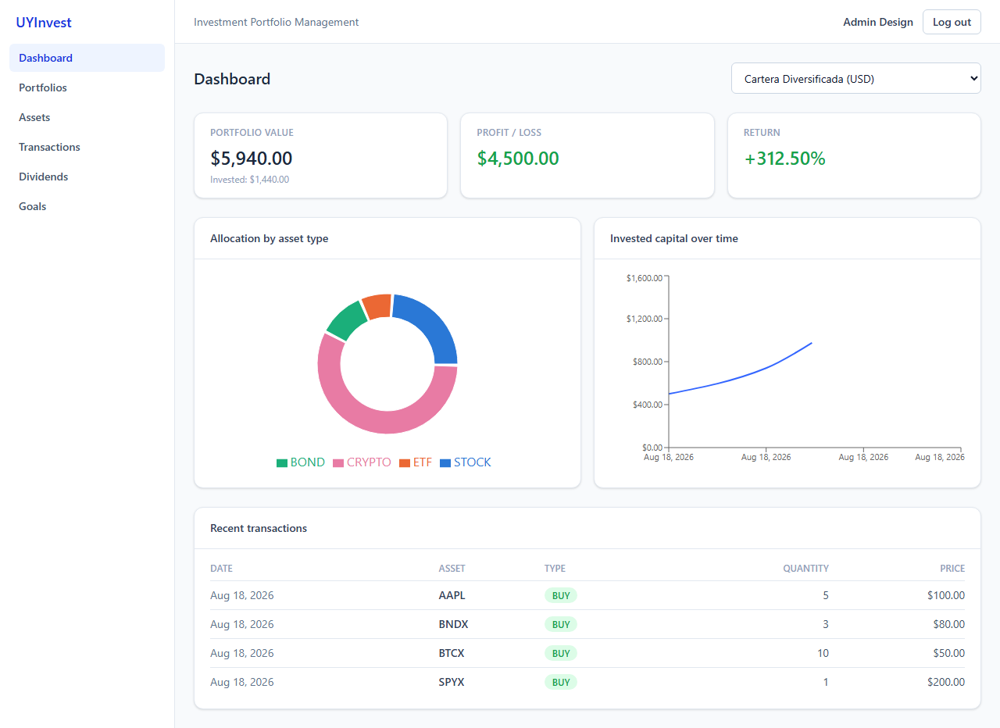
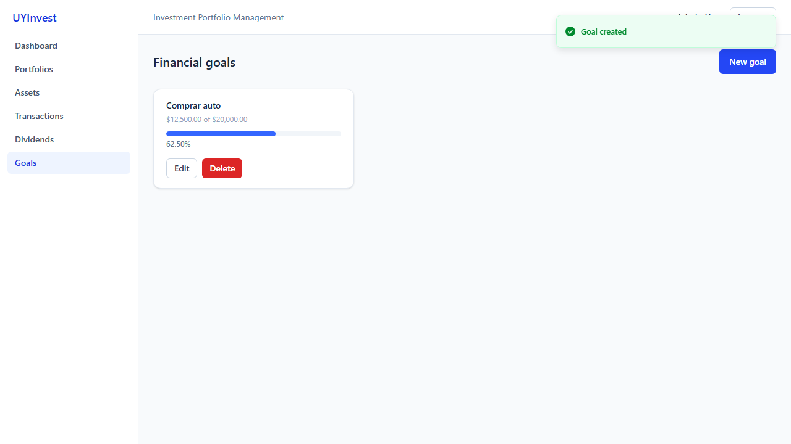
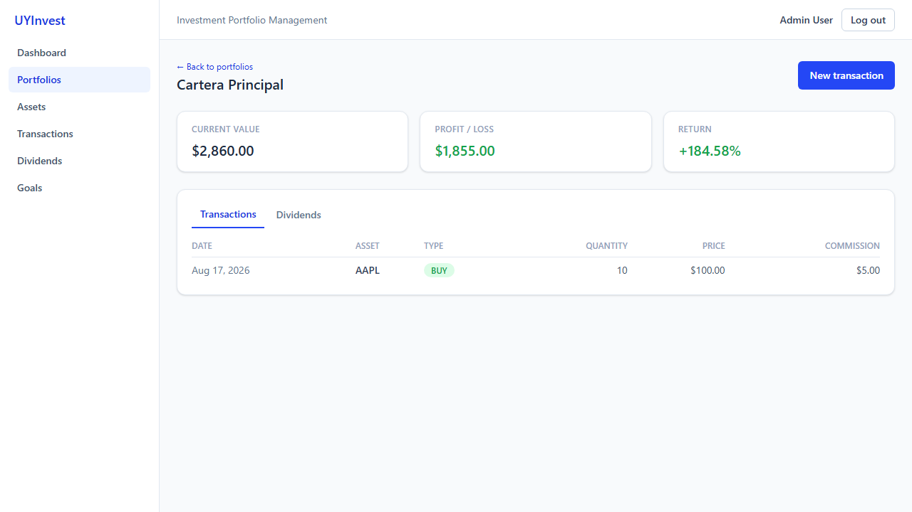
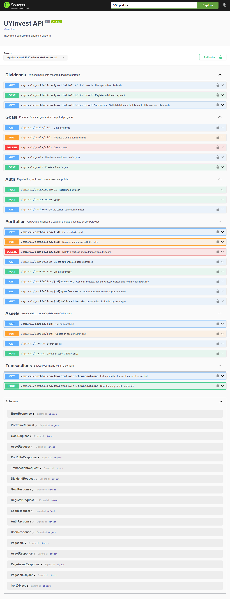
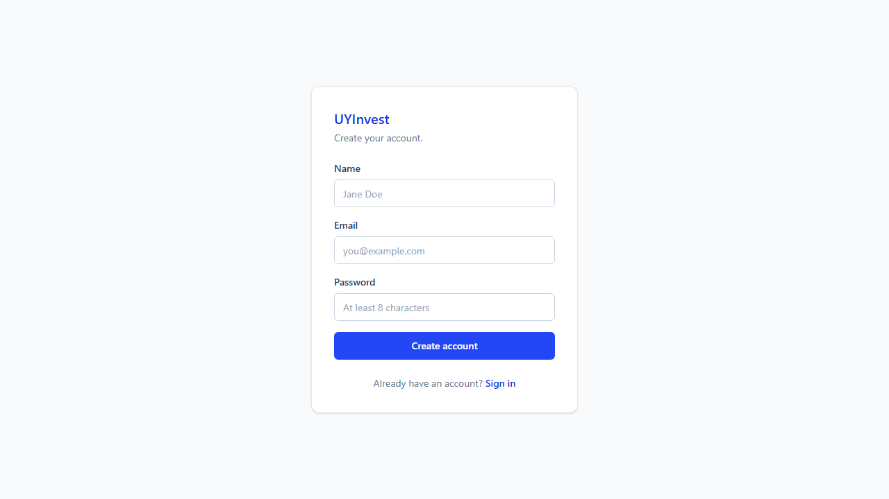

# UYInvest

**Investment Portfolio Management Platform** — a full-stack application to track investment portfolios: what you invested, what it's worth today, your gain/loss, return %, asset allocation, historical evolution, dividends and financial goals.

Built as a portfolio project to demonstrate backend architecture, security, testing and full-stack delivery — not an academic CRUD. The core of the app is a real calculation engine (weighted-average cost basis, unrealized P&L, allocation, performance) with full test coverage matching hand-verified examples.

[](https://github.com/Emmanuel-Miotti/uyinvest/actions/workflows/ci.yml)

## Features

- Email/password auth with JWT, role-based access (`USER` / `ADMIN`)
- Portfolio CRUD, scoped strictly to the authenticated owner
- Asset catalog with search, filtering, pagination — admin-managed
- Buy/sell transactions with quantity/price/commission validation and available-quantity checks on sell
- Portfolio engine: current quantity, average cost, invested capital, current value, profit/loss, return %
- Dashboard: value, P&L, return %, allocation by asset type, invested-capital evolution, recent transactions
- Market price abstraction (`MarketDataProvider`) — deterministic mock by default, pluggable real provider (Finnhub) via one env var
- Dividend tracking with per-asset/date filters and month/year/historical totals
- Financial goals with computed progress
- Responsive dashboard-style UI (desktop-first, working mobile nav) with loading/empty/error states, toasts and confirmation dialogs

## Architecture

Monolithic, layered backend (`controller → service → repository → entity`) — deliberately **not** microservices; a single well-structured Spring Boot app is the right size for this problem.

```
backend/src/main/java/com/uyinvest/
├── controller     # HTTP layer only, no business logic
├── service        # business logic, calculations, authorization
├── repository     # Spring Data JPA + Specifications for dynamic filters
├── entity         # JPA entities, unidirectional @ManyToOne (no bidirectional pitfalls)
├── dto            # request/response records, never expose entities directly
├── mapper         # MapStruct entity↔DTO mapping
├── exception       # centralized @RestControllerAdvice, consistent error shape
├── security        # JWT filter, JWT provider, Spring Security config
└── config          # CORS, OpenAPI, JPA auditing
```

Frontend is a standard Vite SPA (`api/` client layer, `stores/` for auth state, `pages/` per route, hand-built Tailwind UI primitives in `components/ui/`).

## Tech Stack

**Backend:** Java 21 · Spring Boot 3.5 · Spring Security · JWT (jjwt) · Spring Data JPA / Hibernate · PostgreSQL · Flyway · MapStruct · Lombok · JUnit 5 · Mockito · Testcontainers · springdoc-openapi (Swagger)

**Frontend:** React 19 · TypeScript · Vite · React Router · Axios · TanStack Query · Zustand · Tailwind CSS · Recharts · Sonner

**Infra:** Docker · Docker Compose · GitHub Actions

## Database

6 entities (`User`, `Portfolio`, `Asset`, `Transaction`, `Dividend`, `Goal`), versioned with Flyway migrations (`backend/src/main/resources/db/migration`). `NUMERIC` (never `float`/`double`) for every monetary/quantity column, UUID primary keys, `CHECK` constraints enforced at the database level (quantity/price/amount > 0, commission ≥ 0), indexes on every foreign key plus a composite index on `(portfolio_id, asset_id)` for the hot query path. `hibernate.ddl-auto=validate` everywhere — Hibernate never touches the schema.

## API

All endpoints under `/api/v1`. Full interactive docs in Swagger (see below); summary:

```
POST   /auth/register /auth/login          GET /auth/me
GET POST PUT DELETE   /portfolios(/{id})
GET     /portfolios/{id}/summary /allocation /performance
GET POST PUT          /assets(/{id})                        # POST/PUT require ADMIN
GET POST              /portfolios/{id}/transactions
GET POST              /portfolios/{id}/dividends
GET                   /portfolios/{id}/dividends/summary
GET POST PUT DELETE   /goals(/{id})
```

Every list/detail endpoint is scoped to the authenticated user; accessing another user's resource returns `404` (not `403`) to avoid confirming the resource exists.

## Security

- Passwords hashed with BCrypt, never returned in any response
- JWT (HS512) signed with a secret from an environment variable — no fallback secret is used outside local dev, and the local default is clearly labeled as such
- Stateless sessions, CORS restricted to an explicit allow-list (no wildcards)
- Authorization enforced in the service layer on every request (never trusts the frontend)
- Centralized error handling — `400/401/403/404/409/422/500` all return the same JSON shape, stack traces are never exposed to the client
- No hardcoded secrets anywhere in source (backend or frontend) — audited explicitly in Fase 19

## Screenshots

| Dashboard | Goals |
|---|---|
|  |  |

| Portfolio detail | Swagger UI |
|---|---|
|  |  |

| Login | Mobile navigation |
|---|---|
|  |  |

## Installation

Requires JDK 21, Maven, Node 20+, and Docker (for Postgres).

```bash
# 1. Database
docker compose up -d postgres

# 2. Backend (http://localhost:8080)
cd backend
mvn spring-boot:run

# 3. Frontend (http://localhost:5173)
cd frontend
npm install
npm run dev
```

## Docker

The whole stack (Postgres + backend + frontend) runs with one command:

```bash
docker compose up -d --build
```

- Frontend: http://localhost:5173
- Backend: http://localhost:8080
- Postgres: `localhost:5432` (override with `POSTGRES_PORT` if that port is already taken locally)

## Environment Variables

| Variable | Default | Description |
|---|---|---|
| `DB_URL` / `DB_USERNAME` / `DB_PASSWORD` | local Postgres | Database connection |
| `JWT_SECRET` | dev-only value | JWT signing secret — **must** be overridden outside local dev |
| `JWT_EXPIRATION_MS` | `86400000` (24h) | Token lifetime |
| `CORS_ALLOWED_ORIGINS` | `http://localhost:5173` | Allowed frontend origin(s) |
| `MARKET_DATA_PROVIDER` | `mock` | `mock` or `external` (Finnhub) |
| `MARKET_DATA_API_KEY` | _(empty)_ | Required only when `MARKET_DATA_PROVIDER=external` |
| `VITE_API_BASE_URL` (frontend build arg) | `http://localhost:8080/api/v1` | API base URL baked into the frontend build |

## Testing

114 backend tests (JUnit 5 + Mockito for units, Testcontainers with a real PostgreSQL for integration tests — no H2). Covers auth, authorization boundaries, every validation rule, the sell-more-than-held business rule, N+1 query regressions (asserted via real Hibernate statement counts), and the portfolio engine against hand-verified numbers.

```bash
cd backend
mvn test
```

## Swagger

Interactive API docs with JWT auth built in — register/login from the UI, click **Authorize**, then call any protected endpoint.

```
http://localhost:8080/swagger-ui/index.html
```

## CI/CD

GitHub Actions (`.github/workflows/ci.yml`) runs on every push/PR to `main`: backend build → test (real Testcontainers on the runner) → package, and frontend lint → type-check → build. The pipeline fails on any compile error, failing test, or lint error.

## Roadmap

- Real market data provider (Finnhub) activation — architecture is ready, just needs an API key
- Pagination for transaction/dividend lists (currently only assets are paginated, per original scope)
- Multi-currency portfolios with real FX conversion (currently assumes one currency per portfolio, documented simplification)
